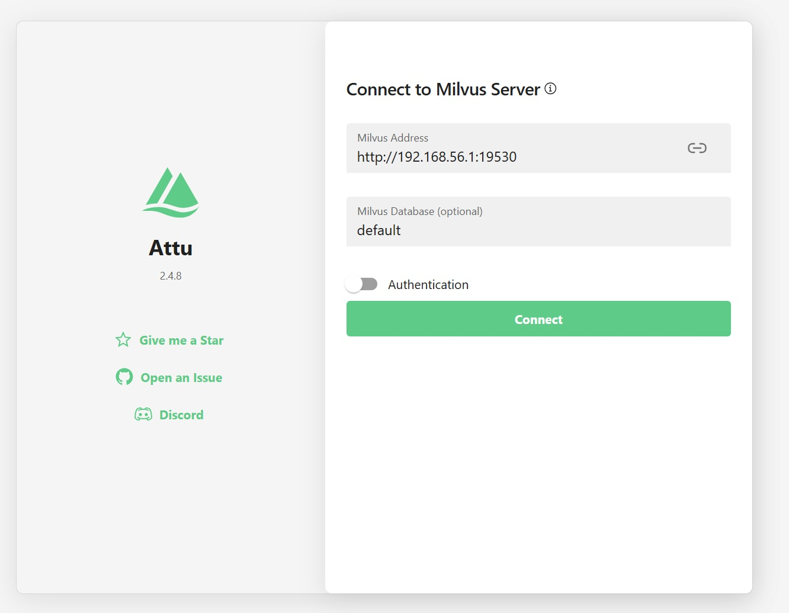
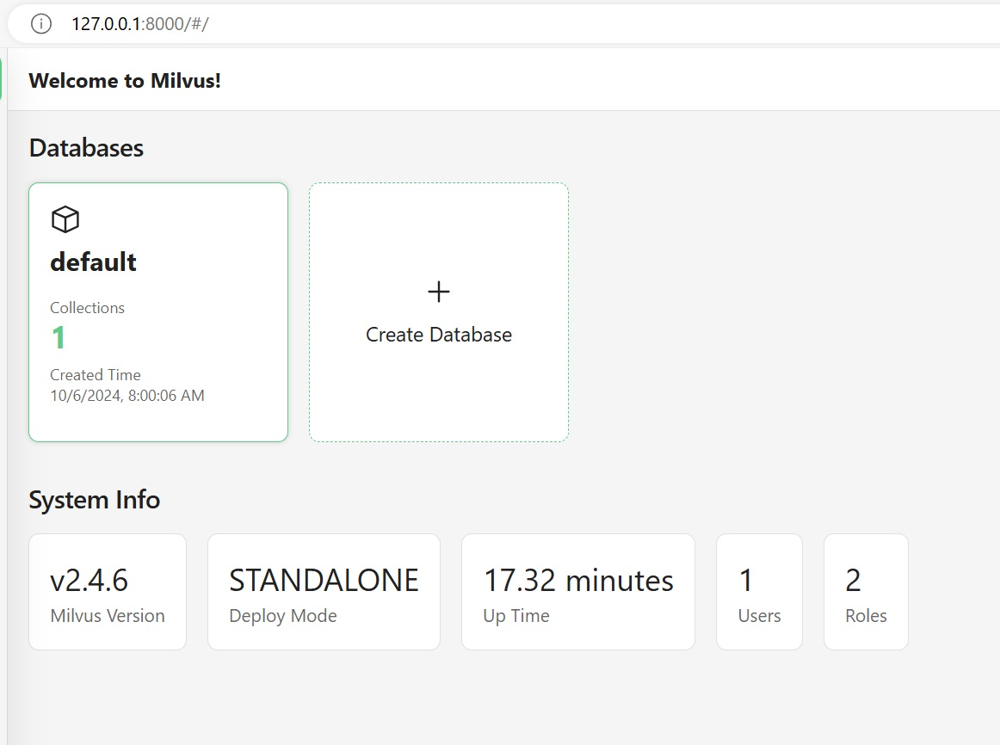

# Interacting with Milvus DB using attu
Use zilliz *attu* application to connect and interact directly with your milvus database
https://github.com/zilliztech/attu/tree/main?tab=readme-ov-file


1. Find your local IP Address:
   ```windows
   > ipconfig
   
   Ethernet adapter Ethernet 3:

   Connection-specific DNS Suffix  . :
   Link-local IPv6 Address . . . . . : fe80::14ce:a887:9134:80ca%11
   IPv4 Address. . . . . . . . . . . : 192.168.56.1
   Subnet Mask . . . . . . . . . . . : 255.255.255.0
   Default Gateway . . . . . . . . . :
    ```
    ```linux\mac
    ifconfig
    ```

    Your'll see several IP Addresses, the one we need should start with `192.168.`

2. Run the below docker command to download and run the attu container. Make sure to update your local the IP address

```
docker run -p 8001:3000 -e MILVUS_URL=http://{your_local_ip_address_here}:19530 zilliz/attu:latest
```

Once the container is up and running, check http://127.0.0.1:8001/
You should get a login screen like this:


Make sure to update the Milvus Address IP address to `http://{your_local_ip_address_here}:19530` and hit connect.
If connected successfully, you should be able to see a dashboard:


