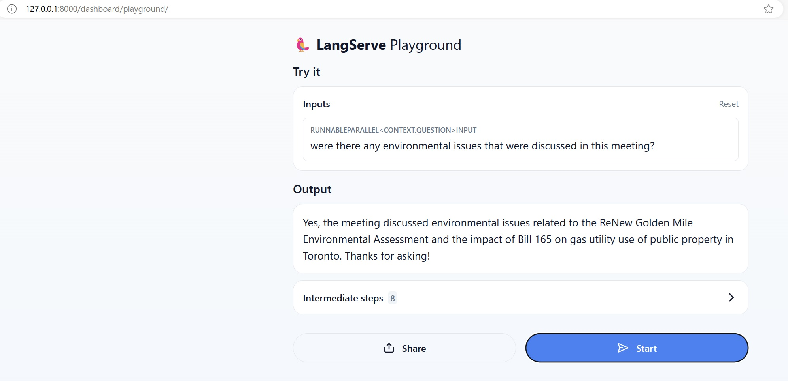

This project uses OpenAI ChatGPT APIs, Langchain and Milvus vector database to perform RAG on Toronto City Council meeting data
Python dependency management is handled using [Poetry](https://python-poetry.org/)

# Project Layout

```
ctto-rag-demo/
├── ctto_rag_demo/
│   ├── data_prep.py
│   ├── scraper.py
│   ├── server.py
│   ├── rag.py
│   └── vectordb/
│       ├── volumes/│           
│       └── docker-compose.yml 
├── tests/
├── data/
├── .env
└── pyproject.toml
```

We are following standard poetry project structure:
- All application code is contained within `ctto-rag-demo` folder
- The actual application code resides inside `ctto-rag-demo/ctto_rag_demo` folder
- Test cases go into `ctto-rag-demo/tests` folder
- Sample Data for reference can be found in `ctto-rag-demo/data` folder

- `data-prep.py` - starting point for the application. Contains two methods:
  - `parse_data` - Fetches the meeting agenda items, scrapes, generates OpenAI embeddings and stores in Milvus DB
  - `start-rag` - Starts the RAG server.
- `.env` file - Contains environment configurations 
- `vectordb/` folder - Contains the docker-compose file to setup milvus-db in your local machine
- `vectordb/volumes` - Shared volumes for the docker containers, so that all data saved to DB will be available when the container is restarted.
- `pyproject.toml` - Poetry configuration file. we define the startup scripts here.


# First Time setup / Pre-requisites

## Setup Poetry
1. Follow the instructions in the official site to install poetry
   https://python-poetry.org/docs/#installation


2. The default poetry virtual environment was not working for me. I was getting errors with numpy install. So I setup a new venv for this project.
   Make sure you are in the top level folder for this project. Run the following command to create a venv

   ```
   python -m venv rag-demo-venv
   ```

   This will create a new folder `rag-demo-venv` in the current folder. 
   
   Activate the new venv:
   ```
     # windows
     ./rag-demo-venv/scripts/activate
   
      # linux/mac
     source ./rag-demo-venv/scripts/activate
   ```
   
   Poetry can automatically detect venv virtual environments and will use it instead of its own venv

3. Check if venv is activated 
   ```
   python check-venv.py
   ```

   If the command prints the path of the venv folder we just created (`rag-demo-venv` if you followed along the previous step), your venv is active.

4. Add dependencies.

   All the dependencies are already defined in `pyproject.toml`. Just run:
   ```
   cd ctto-rag-demo
   poetry install
   ```


## Update OpenAI API Key environment variables
1. Create an openAI API key by following the guide here: https://platform.openai.com/docs/quickstart
2. Update the openAI key in the `.env` file
3. **Optionally** add observability to RAG using Langsmith, Create a free API key from here https://docs.smith.langchain.com/ and add the below variables to the .env file:
   ```
   LANGCHAIN_TRACING_V2=true
   LANGCHAIN_API_KEY=<your_langchain_api_key>
   ```

## Setup Milvus Database
We'll be running milvus in standalone mode in local environment. 
Check if your system configurations meet the hardware requirements for running milvus in standalone mode: https://milvus.io/docs/prerequisite-docker.md

If you system does not support running milvus container locally, try:
   - Running milvus as a python library but you'll have to make some tweaks to change the connection properties to milvus
      https://milvus.io/docs/install-overview.md#Milvus-Lite

   - https://zilliz.com/pricing offers MilvusDB as a managed service with a free tier 

### Setup local Milvus Standalone container
1. Install Docker for your system
https://docs.docker.com/engine/install/


2. Run `docker-compose.yml` file from the _./vectordb/_ folder
   ```
   cd ./ctto-rag-demo/ctto_rag_demo/vectordb
   docker-compose up
   ```
   This will install milvus DB as a docker container in your system and make it up and running.


# Startup the application
Once the first time setup is done, everytime you start a new shell, verify if the venv is active by running `python check-venv.py` from the root folder.
The script should print the path of the python shell. It should give the venv path you created. If you followed along the initial setup, that would be the full path of the `ctto-rag-demo-venv` folder.

If the path is different, venv is not active. Run `{venv-folder}/scripts/activate` where `venv-folder` is the folder created for venv First time setup.

## Start Milvus Container
   ```
   cd ./vectordb
   docker-compose up
   ```


## Running the data aggregator to scrape a meeting and save to milvus DB
Run this any time you want to re-populate the milvus DB. Note that the docker container will retain the populated data even after you shut down the container, so you don't have to run this every time you start up the application. Run this script only when:
- you are starting from scratch 
- you deleted the Milvus docker containers from Docker-Desktop and followed the steps in the [initial setup section](#setup-local-milvus-standalone-container).
- you edited `data-prep.py` to scrape a new meeting.


1. Make sure you are in the `ctto-rag-demo` folder.
2. Run `poetry run populate-db-script`
   This will run the data-scraper and populate the milvus DB with the agenda Items of meeting "2024.IE14"
   https://secure.toronto.ca/council/report.do?meeting=2024.EC14&type=agenda


## Running the server to query against milvus DB using ChatGPT and LangChain:
1. Make sure you are in the `ctto-rag-demo` folder.
2. Run `poetry run start-server-script`
   This will run the **langchain uvicorn** playground where you can run Conversational queries against this meeting data.

Navigate to http://127.0.0.1:8000/dashboard/playground/




## Use rag in the application
Use the `rag.py` `query` method to get RAG output directly into your application.


# Shutdown the application
1. Terminate the poetry script by pressing `CTRL+C` on the terminal where the uvicorn server is running.
2. Shutdown docker containers for milvusDB:
   ```
   cd ctto-rag-demo/ctto_rag_demo/vectordb
   docker-compose down
   ``` 